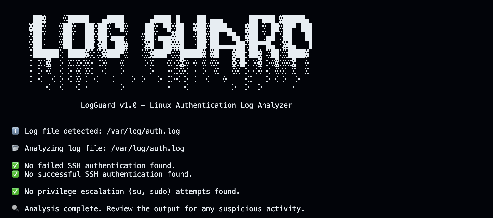
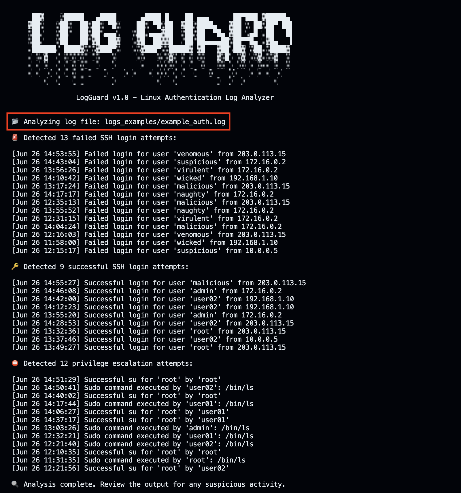
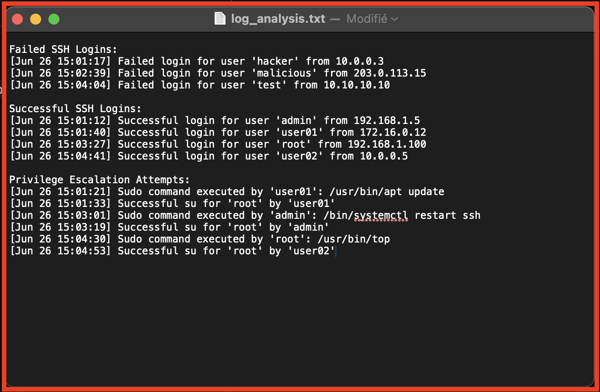

<h1 align="center">
    
</h1>

<p align="center">
LogGuard is a lightweight, beginner-friendly, and extensible Python tool designed to analyze and monitor Linux authentication logs.  
Its primary goal is to help identify suspicious login attempts, unauthorized access, and privilege escalation.
</p>

<p align="center">
  <a href="#description">Description</a> •
  <a href="#features">Features</a> •
  <a href="#installation">Installation</a> •
  <a href="#demonstration">Demonstration</a> •
  <a href="#crontab">Crontab</a>
</p>

<br>

## Description

**LogGuard** is a lightweight, modular, and beginner-friendly Python tool designed to analyze Linux system authentication logs.

Its goal is to help identify suspicious login activity such as failed SSH attempts, unauthorized access, and privilege escalation commands (`sudo`, `su`) by parsing real system logs (`/var/log/auth.log`, `/var/log/secure`, or custom files).

Originally created as a learning project to explore Python and system log parsing, LogGuard now serves as a solid base for anyone who wants to:
- Understand how authentication events are logged on Linux
- Build simple tools for threat detection or audit purposes
- Practice Python coding in a real-world context

The code is clean and modular, making it easy to extend or integrate into larger security tools.
<br>
<br>

## Features

✅ **Current capabilities**:
- Auto-detects standard Linux authentication logs (`/var/log/auth.log`, `/var/log/secure`)
- Supports custom log file path with `--custom-log`
- Parses SSH failed login attempts
- Extracts timestamp, username, and source IP from log entries
- Displays failed SSH login attempts in a readable format
- Detection of successful SSH logins
- Detection of `sudo` and `su` usage (privilege escalation)
- Export to `.txt` files with `--export-txt`

🛠️ **Work in progress**:
- Export to JSON
- HTML report generation (future)
<br>

## Installation

1. **Clone the repository**:

```bash
git clone https://github.com/RikoRiken/LogGuard.git
cd LogGuard
```
<br>

2. **Run the tool**:
```bash
python3 LogGuard.py


# 💡 You can also specify a custom log file:
python3 LogGuard.py --custom-log path/to/custom_file.log


# 💡 Or you can export to a .txt/.log file:
python3 LogGuard.py --export-txt file_name.txt
```
<br>

<h3 align="center"> ❗️ In case you don't have systems logs (/var/log/auth.log`) in your system ❗️</h3>

Sometimes on Virtual Machines, `rsyslog` isn't installed, and so you'll note have the authentications logs like `/var/log/auth.log`. In case, executes the following (on debian-like):
```bash
sudo apt update && apt upgrade 

sudo apt install rsyslog

cd /var/log/ 
ls -lah          # You need to see a file "auth.log" or "secure"
```

<br>

## Demonstration

1. Successful Analysis with automaticaly captured log `/var/log/auth.log`

   Command = `python3 LogGuard.py`


<br>

2. Dangerous analysis reported on custom logs

    Command = `python3 LogGuard.py --custom-log logs_examples/example1_auth.log`


<br>

3. Exporting results in `.txt` file

    Command = `python3 LogGuard.py --export-txt log_analysis.txt`

<p align="center">

</p>

<br>

## Crontab

**Automation:** You can planify a regular execution of LogGuard with `Crontab` in linux, to automaticaly analyse the log files of your system.

```bash 
# 1️⃣ Add execution binary to script
sudo chmod +x /path/to/LogGuard.py

# 2️⃣ Edit crontab of current user 
crontab -e

# 3️⃣ Execute LogGuard every hour 
0 * * * * /usr/bin/python3 /absolute_path/to/logguard.py  --export-txt /path/to/logguard_report.txt   # (0 * * * * means: every minute 0 of each hours)

# Verify your crontab is operational
crontab -l

```